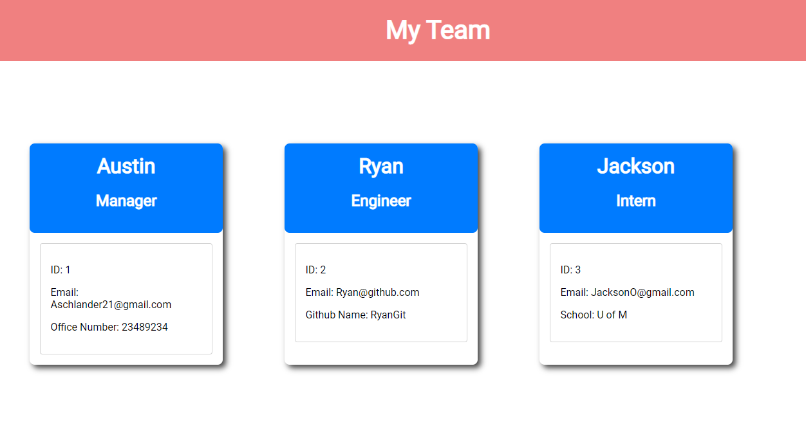
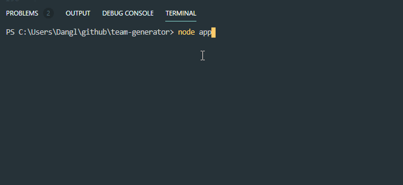

# team-generator

A node CLI that will accept user input to generate information about a software engineering team

# ScreenShots

# GIF

# Built With

NodeJS, and Inquierer

# Authors

Austin Schlander